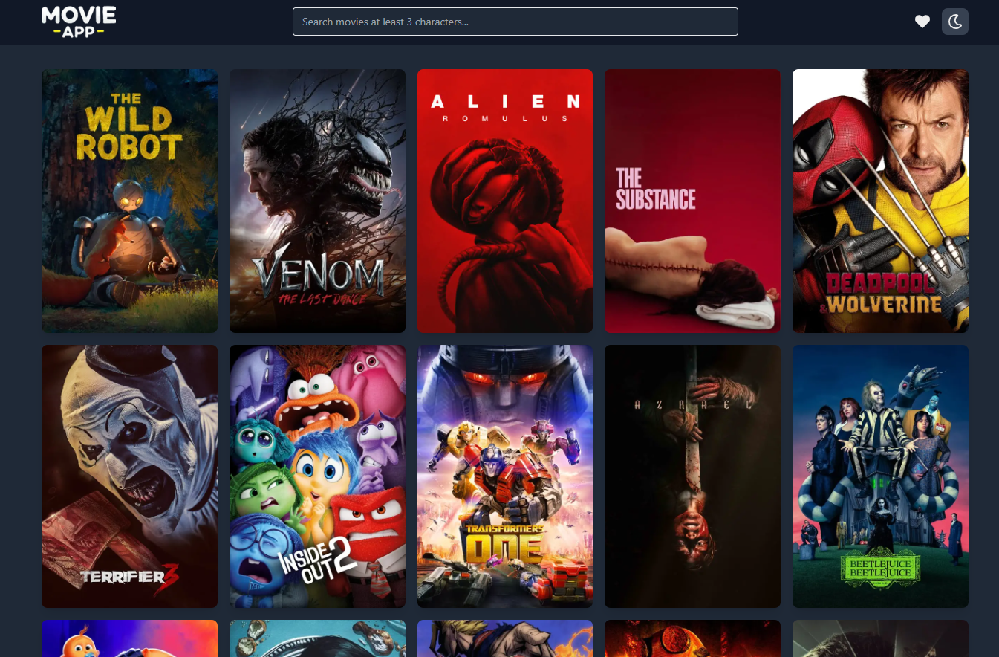

## 🔗 Live Demo

Visit the live application at: [https://movie-app-ivory-iota.vercel.app](https://movie-app-ivory-iota.vercel.app/)

# Next.js Movie Application

A modern, responsive movie discovery platform built with Next.js 14, TMDB API, and cutting-edge web technologies. This application allows users to explore popular movies, search for specific titles, view detailed information, and maintain a personal watchlist.



## 🌟 Features

### Core Functionality
- **Homepage with Infinite Scrolling**
  - Browse popular movies with dynamic loading
  - Lazy-loaded movie posters for optimal performance
  - Responsive grid layout adapting to all screen sizes

- **Advanced Search**
  - Real-time search with debouncing
  - Form validation using React Hook Form
  - Clean error handling and loading states

- **Detailed Movie Information**
  - Server-side rendered movie details
  - Cast information and recommendations
  - Incremental Static Regeneration (ISR) for optimal performance
  - Incremental data fetching in details page for casting API and recommendation API call

- **Personal Watchlist**
  - Add/remove movies to watchlist
  - Optimistic UI updates
  - Server Actions implementation
  - Persistent storage

- **Dark Mode**
  - System preference detection
  - Persistent theme selection
  - Smooth transitions

### Technical Implementation

#### Performance Optimizations
- Implemented ISR with 60-second revalidation
- Dynamic API response caching
- Image optimization with Next.js Image component
- Code splitting and lazy loading

#### Data Validation & Type Safety
- TypeScript implementation
- Zod schema validation for API responses
- Error boundary implementation

#### State Management
- Global state handling with Zustand & Context Api
- Server state management with TanStack Query
- Optimistic updates for improved UX

## 🚀 Technology Stack

- **Frontend Framework**: Next.js 14
- **Styling**: Tailwind CSS
- **State Management**: Zustand & Context Api
- **Form Handling**: React Hook Form
- **Data Fetching**: TanStack Query
- **Type Safety**: TypeScript
- **Validation**: Zod
- **API**: TMDB API

## 🛠️ Installation & Setup

```bash
# Clone the repository
https://github.com/nurullah7733/movie-app.git

# Install dependencies
npm install

# Create .env.local file and add your TMDB API key
NEXT_PUBLIC_TMDB_API_KEY=your_api_key_here

# Run the development server
npm run dev
```

## 📝 Future Improvements

1. **Authentication System**
   - Planning to implement a full authentication system using Next.js Middleware
   - Protect watchlist routes with authentication
   - Add user profiles and preferences

2. **Enhanced Features**
   - User ratings and reviews
   - Social sharing functionality
   - Advanced filtering options
   - Personalized movie recommendations

---

Built with ❤️ using Next.js and modern web technologies.
